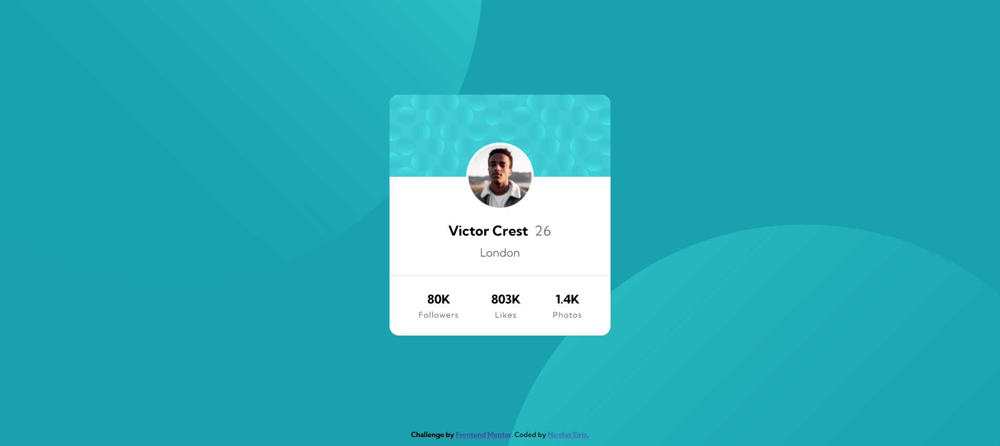

# Frontend Mentor - Profile card component solution

This is a solution to the [Profile card component challenge on Frontend Mentor](https://www.frontendmentor.io/challenges/profile-card-component-cfArpWshJ). Frontend Mentor challenges help you improve your coding skills by building realistic projects. 

## Table of contents

  - [The challenge](#the-challenge)
  - [Screenshot](#screenshot)
  - [Links](#links)
  - [Built with](#built-with)
  - [What I learned](#what-i-learned)
  - [Continued development](#continued-development)
  - [Useful resources](#useful-resources)
- [Author](#author)

### The challenge

- Build out the project to the designs provided

### Screenshot

### Links

- Solution URL: [Add solution URL here](https://your-solution-url.com)
- Live Site URL: [Add live site URL here](https://your-live-site-url.com)

## My process

### Built with

- Semantic HTML5 markup
- CSS custom properties
- Flexbox

### What I learned

A great challenge because this was my first project, I learned that the real questions start when you try to apply your knowledge to a particular process.  

First I took the design of the card to a piece of paper and there I tried to structure it as simple as possible. I divided the content in three big categories: Header, Section and Footer.

The major challenge was to position the two balls that are placed behind the card, because of this I learned the difference between "position: relative and absolut".

### Continued development

I will be focusing on learning the fundamentals of html and css, so I will be able to gain a solid knowledge and then move on to other areas. My next goal is to create the same design with a simplified code.

### Useful resources

- https://css-tricks.com/snippets/css/a-guide-to-flexbox/ - This helped me to understand the concept of flex and flexbox and how to apply it in the footer of this challenge.

## Author

- Website - [Nicolas Eiriz](https://nicolaseiriz.github.io/Profile-card-component-challenge-hub/)
- Frontend Mentor - [@NicolasEiriz](https://www.frontendmentor.io/profile/NicolasEiriz)
- Twitter - [@EirizNico](https://twitter.com/EirizNico)

